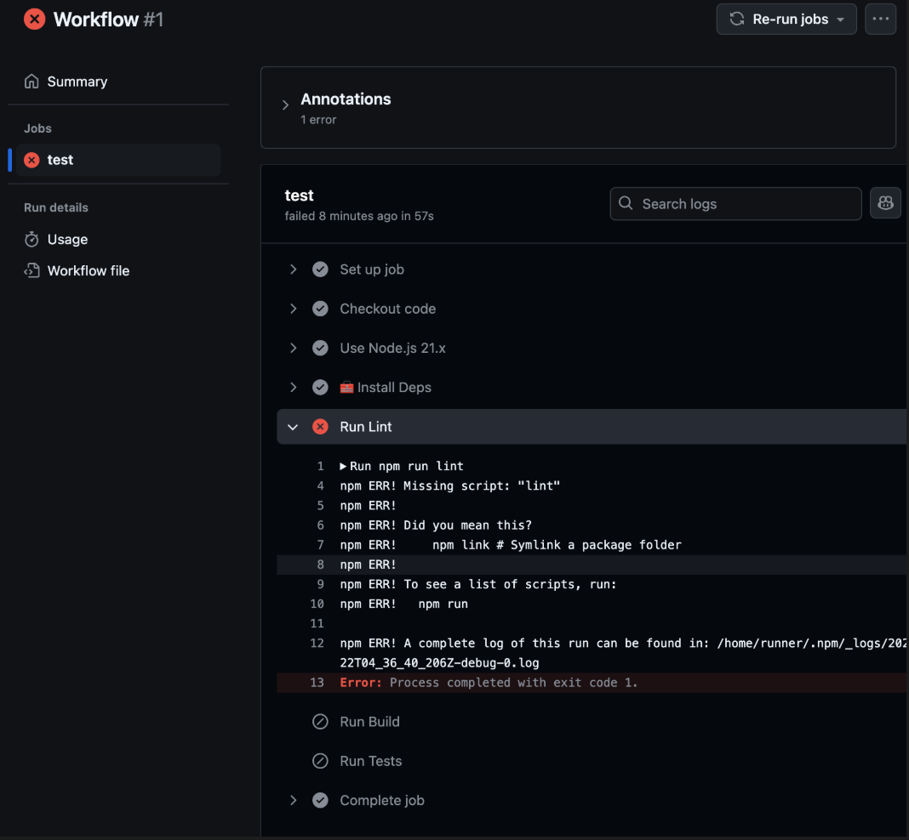

# CI_CD-pipeline

## Description

The following demonstrates the testing of an application using a Continuous Inegration and Continuous Deployment pipeline. Tests are to be ran using GitHub Actions via Cypress.

## Image

## Link

URL for application: https://ci-cd-pipeline-ejj4.onrender.com

## Contributing

Ongoing contributions can be made using the GitHub repository.

## Tests

Tests can be ran using GitHub Actions and updates can be done on the GitHub repository.

## Questions

If you have any questions, please contact me at wmvrisso@gmail.com.
